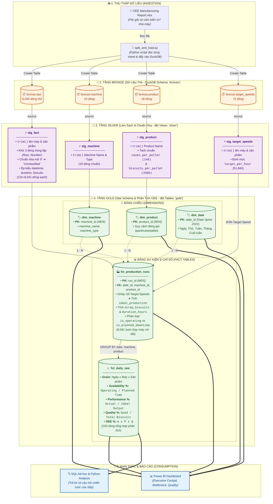

# KIẾN TRÚC & SƠ ĐỒ QUY TRÌNH XỬ LÝ DỮ LIỆU DBT
## DỰ ÁN: PHÂN TÍCH VÀ TỐI ƯU HÓA OEE NHÀ MÁY BÁNH QUY GRANDMA EDNA

---

## 1. SƠ ĐỒ TỔNG QUAN DÒNG CHẢY DỮ LIỆU (DATA LINEAGE PIPELINE)

Dự án áp dụng kiến trúc chuẩn ngành **Medallion Architecture (Bronze ➔ Silver ➔ Gold)** kết hợp với mô hình **Star Schema** trong data warehouse DuckDB được điều phối bởi **dbt (data build tool)**:



---

## 2. CHI TIẾT CÁC TẦNG XỬ LÝ (DETAILED STAGES)

### GIAI ĐOẠN 1: INGESTION (NẠP DỮ LIỆU)
* **File thực thi**: `split_and_load.py`
* **Cơ chế**:
  * Đọc file nguồn `/Users/thienngocpham/Downloads/OEE Manufacturing Report.xlsx`.
  * Tách 4 sheets (`Fact`, `Machine`, `Product`, `Target Speeds`) thành các file Excel con độc lập để lưu trữ dự phòng.
  * Khởi tạo database DuckDB cục bộ `my_factory.duckdb` và nạp toàn bộ dữ liệu vào schema thô `bronze`.

---

### GIAI ĐOẠN 2: TẦNG BRONZE (RAW DATA LAYER)
Lưu trữ dữ liệu nguyên trạng, không thay đổi logic hay lọc bỏ giá trị:
* **`bronze.fact`** (8,044 dòng): Ghi nhận thời gian bắt đầu, kết thúc, thời lượng, số lượng bánh làm ra, số lượng bánh đạt, trạng thái máy và dòng sản phẩm.
* **`bronze.machine`** (10 dòng): Danh mục 10 loại máy trong nhà máy.
* **`bronze.product`** (18 dòng): Danh mục 18 dòng bánh quy và quy cách đóng gói.
* **`bronze.target_speeds`** (72 dòng): Tốc độ mục tiêu chuẩn theo từng cặp (Máy, Sản phẩm).

---

### GIAI ĐOẠN 3: TẦNG SILVER (LÀM SẠCH & CHUẨN HÓA DỮ LIỆU VỚI DBT)
Tầng này được materialize dưới dạng **Views** trong dbt (`models/staging/`), tập trung giải quyết 4 vấn đề chất lượng dữ liệu:

1. **Khử khoảng trắng thừa (`trim()`)**:
   * *Vấn đề*: Tên máy trong dữ liệu gốc chứa dấu cách ở đuôi (ví dụ: `'Biscuit Filling Machine '`).
   * *Xử lý*: Dùng `trim()` đồng bộ trên tất cả các bảng staging (`stg_fact`, `stg_machine`, `stg_target_speeds`) để các lệnh JOIN sau này khớp 100%.
2. **Khử trùng lặp bản ghi (Deduplication)**:
   * *Vấn đề*: Có 3 cặp dòng bị trùng lặp hoàn toàn thời gian và máy chạy.
   * *Xử lý*: Áp dụng window function `row_number() over (partition by machine_name, start_datetime, end_datetime, product_name order by total_biscuits_made desc) = 1`. Dữ liệu rút gọn từ 8,044 dòng xuống còn **8,041 dòng chuẩn**.
3. **Chuẩn hóa danh mục OEE**:
   * *Vấn đề*: Cột `OEE Category` chứa 12 dòng mang giá trị `'0'`.
   * *Xử lý*: Quy đổi `'0'` thành `'Unclassified'` để giữ toàn vẹn dữ liệu và phân tích được lý do dừng máy chưa phân loại.
4. **Chuẩn hóa thông số đóng gói sản phẩm**:
   * *Vấn đề*: Cột `Biscuits_PER_PALLET` trong file gốc có giá trị 140 (thực chất là số thùng/pallet).
   * *Xử lý*: Bổ sung cột `cases_per_pallet = 140` và `biscuits_per_pallet = 3360` (24 hộp/thùng x 140 thùng/pallet = 3,360 bánh/pallet).

---

### GIAI ĐOẠN 4: TẦNG GOLD (STAR SCHEMA & TÍNH TOÁN OEE)
Tầng này được materialize dưới dạng **Tables** vật lý trong dbt (`models/marts/`) để tối ưu tốc độ truy vấn:

#### A. Các Bảng Chiều (Dimensions)
* **`gold.dim_machine`** (10 dòng):
  * Khóa chính: `machine_id = md5(machine_name)`.
  * Thuộc tính: `machine_name`, `machine_type`.
* **`gold.dim_product`** (18 dòng):
  * Khóa chính: `product_id = md5(product_name)`.
  * Thuộc tính: `product_name`, `biscuits_per_pack`, `biscuits_per_case`, `cases_per_pallet`, `biscuits_per_pallet`.
* **`gold.dim_date`** (365 dòng):
  * Khóa chính: `date_id` (Kiểu Date từ `2021-01-01` đến `2021-12-31`).
  * Sinh tự động bằng hàm `generate_series()` của DuckDB với đầy đủ các thuộc tính: `day_name`, `day_of_week`, `week_of_year`, `month`, `quarter`, `year`, `is_weekend`.

#### B. Các Bảng Sự Kiện & Chỉ Số (Facts)
* **`gold.fct_production_runs`** (8,041 dòng - Grain: Từng ca/sự kiện chạy máy):
  * Khóa chính: `run_id = md5(machine_name || start_datetime || end_datetime || product_name)`.
  * Khóa ngoại: `date_id`, `machine_id`, `product_id`.
  * Ghép nối với `stg_target_speeds` để lấy `target_biscuits_per_hour` (51,840).
  * Tính toán các trường phái sinh:
    * `duration_hours = duration_minutes / 60.0`.
    * `ideal_production = duration_hours * target_biscuits_per_hour`.
    * `effective_total_biscuits = greatest(total_biscuits_made, good_biscuits_made)`.
    * `scrap_biscuits_made = greatest(0, total_biscuits_made - good_biscuits_made)`.
    * Flag phân loại trạng thái: `is_operating_time` (Run Time, CC) và `is_planned_downtime` (PM, NO).
* **`gold.fct_daily_oee`** (193 dòng - Grain: Ngày x Máy x Sản phẩm):
  * Bảng tổng hợp sẵn OEE phục vụ báo cáo quản trị:
    $$\text{Availability \%} = \frac{\text{Operating Hours}}{\text{Planned Production Hours}} \times 100$$
    $$\text{Performance \%} = \min\left(100.0, \frac{\text{Effective Total Biscuits}}{\text{Ideal Biscuits}} \times 100\right)$$
    $$\text{Quality \%} = \frac{\text{Good Biscuits}}{\text{Effective Total Biscuits}} \times 100$$
    $$\text{OEE \%} = \text{Availability} \times \text{Performance} \times \text{Quality}$$

---

## 3. BẢO CHỨNG CHẤT LƯỢNG DỮ LIỆU (DBT DATA TESTS)

Hệ thống được thiết lập **19 bài kiểm thử tự động** trong file [models/marts/schema.yml](file:///Users/thienngocpham/Documents/Study/OEE_Manufacturing_Analysis/models/marts/schema.yml), đạt kết quả **100% PASS (19/19)**:

| Loại Test | Đối tượng kiểm tra | Kết quả kiểm tra | Ý nghĩa công nghiệp |
| :--- | :--- | :---: | :--- |
| **`unique`** | Khóa chính `machine_id`, `product_id`, `date_id`, `run_id` | **PASS** | Đảm bảo không có bất kỳ bản ghi nào bị trùng lặp khóa. |
| **`not_null`** | Tất cả các cột khóa chính và khóa ngoại trong Dimension & Fact | **PASS** | Tuyệt đối không có dòng dữ liệu mồ côi hoặc thiếu sót định danh. |
| **`relationships`** | Khóa ngoại trong `fct_production_runs` liên kết tới `dim_machine`, `dim_product`, `dim_date` | **PASS** | Đảm bảo toàn vẹn tham chiếu 100%: Mọi sự kiện trong Fact đều có thông tin đối ứng trong Dimension. |

---

## 4. HƯỚNG DẪN LỆNH THỰC THI & VẬN HÀNH

Sau khi kích hoạt môi trường ảo (`source .venv/bin/activate`), bạn có thể sử dụng các lệnh điều phối sau:

```bash
# 1. Kiểm tra kết nối dbt với database DuckDB
dbt debug --profiles-dir .

# 2. Thực thi toàn bộ pipeline dbt (Silver -> Gold)
dbt run --profiles-dir .

# 3. Chạy 19 bài kiểm thử toàn vẹn dữ liệu
dbt test --profiles-dir .

# 4. Kiểm tra số lượng dòng và xem mẫu dữ liệu 3 tầng (Bronze, Silver, Gold)
python check_data.py
```
