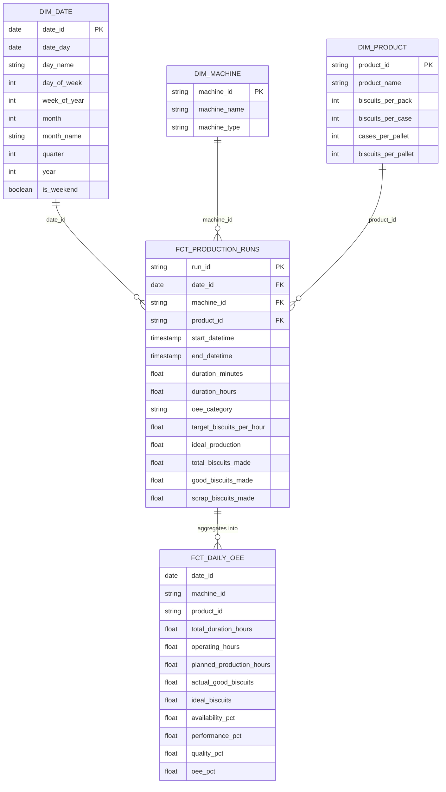

# Kế hoạch làm sạch dữ liệu & Xây dựng mô hình Star Schema (dbt + DuckDB)

Tài liệu này mô tả chi tiết kế hoạch xử lý các vấn đề chất lượng dữ liệu (Data Quality issues) phát hiện được từ dữ liệu thô, sau đó thiết kế và xây dựng mô hình **Star Schema** hoàn chỉnh trong tầng **Gold (Marts)** phục vụ phân tích OEE (Overall Equipment Effectiveness).

---

## 1. Kết quả phân tích chất lượng dữ liệu (Data Profiling)

Qua kiểm tra 8,044 dòng dữ liệu sản xuất và các bảng danh mục, chúng tôi phát hiện một số vấn đề cần làm sạch:
1. **Khoảng trắng thừa (Trailing spaces)**: Cột `machine_name` ở tất cả các bảng đều có khoảng trắng ở cuối (VD: `'Biscuit Filling Machine '`). Cần `trim()` để đảm bảo tính toàn vẹn khi JOIN.
2. **Dòng trùng lặp (Duplicates)**: Có 3 cặp dòng bị ghi nhận trùng lặp hoàn toàn thời gian và máy trong bảng `fact` (8,044 dòng nhưng chỉ có 8,041 lượt chạy máy độc lập). Cần khử trùng (deduplication).
3. **Giá trị bất thường trong `oee_category`**: Có 12 dòng mang giá trị `'0'` (thay vì `'Run Time'`, `'CC (Changeover Cleaning)'`, `'NO (No Order)'`, `'PM (Maintenance)'`). Cần chuẩn hóa thành `'Unclassified'`.
4. **Bất thường giữa `total_biscuits_made` và `good_biscuits_made`**:
   - Ở 8 loại máy (Boxing, Heating, Topping, Forming, Mixing, Pressing, Heat, Jam): Cột `total_biscuits_made` luôn bằng `0`, nhưng `good_biscuits_made` có số liệu.
   - Do đó, cần tạo cột số liệu chuẩn hóa: `effective_total_biscuits = greatest(total_biscuits_made, good_biscuits_made)` và `scrap_biscuits = greatest(0, total_biscuits_made - good_biscuits_made)`.
5. **Cột bảng `product`**: Cột `Biscuits_PER_PALLET` mang giá trị 140 (thực tế là `cases_per_pallet` vì 24 hộp/thùng x 140 thùng/pallet = 3,360 bánh/pallet). Cần đưa cột `Bsicuits Per Pallet` (3360) vào model và đặt tên rõ ràng.

---

## 2. Thiết kế mô hình Star Schema



---

## User Review Required

> [!IMPORTANT]
> **Định nghĩa OEE trong dự án:**
> - **Availability (Khả dụng)**: Tỷ lệ thời gian máy chạy thực tế so với thời gian kế hoạch:
>   $$\text{Availability} = \frac{\text{Operating Time}}{\text{Planned Production Time}}$$
>   Trong đó `Run Time`, `CC (Changeover)` là thời gian vận hành/chuyển đổi; `PM (Maintenance)` và `NO (No Order)` là thời gian dừng máy kế hoạch/chờ đơn.
> - **Performance (Hiệu suất)**: Tỷ lệ sản lượng thực tế tạo ra so với sản lượng lý thuyết theo tốc độ chuẩn:
>   $$\text{Performance} = \frac{\text{Total Output}}{\text{Operating Time (hours)} \times \text{Target Speed per hour}}$$
> - **Quality (Chất lượng)**: Tỷ lệ sản phẩm đạt chuẩn trên tổng sản phẩm làm ra:
>   $$\text{Quality} = \frac{\text{Good Biscuits}}{\text{Total Biscuits}}$$
> - **OEE** = $\text{Availability} \times \text{Performance} \times \text{Quality}$.

---

## Proposed Changes

### Tầng Staging (Làm sạch dữ liệu)

#### [MODIFY] [stg_fact.sql](file:///Users/thienngocpham/Documents/Study/OEE_Manufacturing_Analysis/models/staging/stg_fact.sql)
- Thêm `trim()` cho tên máy và sản phẩm.
- Chuẩn hóa `oee_category` (chuyển `'0'` thành `'Unclassified'`).
- Khử các dòng trùng lặp bằng `row_number() over (partition by machine_name, start_datetime, end_datetime, product_name order by total_biscuits_made desc)`.

#### [MODIFY] [stg_machine.sql](file:///Users/thienngocpham/Documents/Study/OEE_Manufacturing_Analysis/models/staging/stg_machine.sql)
- Thêm `trim()` cho `machine_name` và `machine_type`.

#### [MODIFY] [stg_product.sql](file:///Users/thienngocpham/Documents/Study/OEE_Manufacturing_Analysis/models/staging/stg_product.sql)
- Thêm `trim()` cho `product_name`.
- Lấy đầy đủ 2 cột: `cases_per_pallet` (140) và `biscuits_per_pallet` (3360).

#### [MODIFY] [stg_target_speeds.sql](file:///Users/thienngocpham/Documents/Study/OEE_Manufacturing_Analysis/models/staging/stg_target_speeds.sql)
- Thêm `trim()` cho `machine_name` và `product_name`.

---

### Tầng Marts (Star Schema - Gold Layer)

#### [NEW] [dim_machine.sql](file:///Users/thienngocpham/Documents/Study/OEE_Manufacturing_Analysis/models/marts/dim_machine.sql)
- Bảng Dimension lưu trữ danh mục máy, sinh `machine_id` (Surrogate Key qua hàm băm `md5(machine_name)`).

#### [NEW] [dim_product.sql](file:///Users/thienngocpham/Documents/Study/OEE_Manufacturing_Analysis/models/marts/dim_product.sql)
- Bảng Dimension lưu trữ danh mục sản phẩm và quy cách đóng gói, sinh `product_id` (Surrogate Key qua `md5(product_name)`).

#### [NEW] [dim_date.sql](file:///Users/thienngocpham/Documents/Study/OEE_Manufacturing_Analysis/models/marts/dim_date.sql)
- Bảng Dimension thời gian được tự động sinh bằng DuckDB `generate_series()` bao phủ toàn bộ khoảng thời gian sản xuất (2021), cung cấp các thuộc tính ngày, tháng, quý, năm, thứ trong tuần, cuối tuần.

#### [NEW] [fct_production_runs.sql](file:///Users/thienngocpham/Documents/Study/OEE_Manufacturing_Analysis/models/marts/fct_production_runs.sql)
- Bảng Fact chi tiết (Granularity: từng lần chạy máy/sự kiện).
- Khóa chính `run_id`, các khóa ngoại `machine_id`, `product_id`, `date_id`.
- Ghép nối tốc độ mục tiêu `target_biscuits_per_hour` từ `stg_target_speeds`.
- Tính toán `duration_hours`, `ideal_production`, `scrap_biscuits_made`, `effective_total_biscuits`.

#### [NEW] [fct_daily_oee.sql](file:///Users/thienngocpham/Documents/Study/OEE_Manufacturing_Analysis/models/marts/fct_daily_oee.sql)
- Bảng Fact tổng hợp OEE theo ngày, máy và sản phẩm.
- Tính toán đầy đủ 3 chỉ số thành phần: **Availability Rate (%)**, **Performance Rate (%)**, **Quality Rate (%)**, và chỉ số tổng hợp **OEE (%)**.

---

## Verification Plan

### Automated Tests
1. **Build toàn bộ mô hình qua dbt**:
   ```bash
   .venv/bin/dbt run --profiles-dir .
   ```
   *Yêu cầu*: Build thành công cả 4 staging views trong `silver` và 5 marts tables/views trong `gold`.

2. **Chạy dbt test**:
   - Thêm các kiểm tra ràng buộc khóa chính (`unique`, `not_null`) và quan hệ (`relationships`) trong schema test.
   ```bash
   .venv/bin/dbt test --profiles-dir .
   ```

3. **Kiểm tra dữ liệu thực tế bằng Python script**:
   ```bash
   .venv/bin/python check_data.py
   ```
   *Yêu cầu*: Schema `gold` có đủ các bảng `dim_machine`, `dim_product`, `dim_date`, `fct_production_runs`, `fct_daily_oee` với dữ liệu chuẩn xác, không bị null khóa ngoại.
